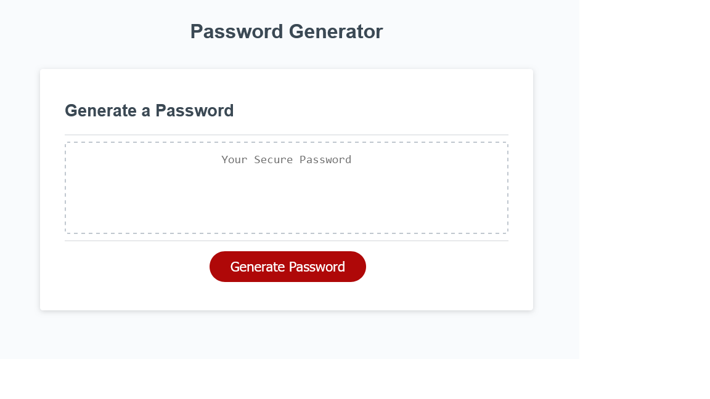

## Password Generator

This project was to build a random password generator, based off of user selected character types and a specified length of characters to be between 8 and 128.

## Russell Booth's working Portfolio

   

Link to project: https://russellbooth.github.io/Password-Generator/

## Built With

    HTML
    CSS
    Javascript

## Installation

    There is currently no software or additional installations needed to use this project. Just a mobile device, tablet, or computer with web capabilities.

## Usage

The Usage of this project is a resource to generate random password for use in creating accounts that require specific character types and lengths.

  

## License

Distributed under the MIT License. See LICENSE.txt for more information.

## How to Contribute

If there are any way you feel there is good feedback, and would like to contribute to discussion on the building of my portfolio please feel free to contact me here on GitHub or within my contact information within the ## Contact section.

## Contact

Russell Booth - russellbooth121@gmail.com

Project Link: https://github.com/RussellBooth/Portfolio

## Acknowledgments/Credits

    The UC Davis Coding Bootcamp. For hosting an amazing program with very dedicated staff and support
    The started code used in this program was provided by the UC Davis Coding Bootcamp, in which was built off to build a functional program.
    My wonderful instructor and TA, Alex Kauffman and Zach Warner.
